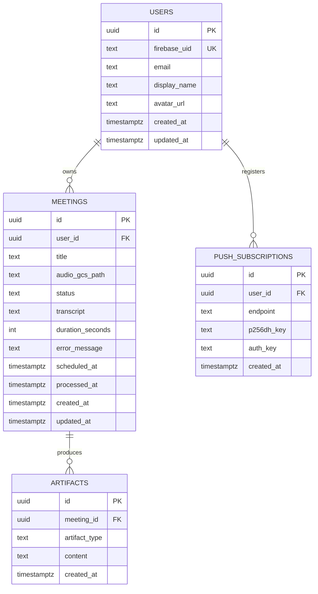

# Busy Bee — MVP 產品規劃與技術設計書

> 日期：2026-07-17
> 作者：Charles（與 AI Agent 協同產出）
> 狀態：已核准設計，待產出實作計畫

---

## 1. 產品概述

Busy Bee 是一個專為開發團隊/技術主管設計的 AI 輔助工具：

**開會錄音 → 語音轉文字（STT）→ LLM 分析 → 產出結構化技術文件（PRD & Tech Spec）**

### 目標

- 兼顧「面試展示含金量」與「實際工作落地」
- Solo 開發（每週 10-15 小時），4 個 Milestone、約 12 週完成 MVP

### MVP 功能範疇

1. **語音錄製與上傳**：PWA 瀏覽器錄音（MediaRecorder）+ 拖曳上傳預錄音訊檔（.mp3 / .m4a / .webm）
2. **非同步音訊處理工作流**：上傳 → 背景任務 → STT → LLM 分析 → 結構化文件
3. **AI 智能生成**：產出結構化「開發文件（PRD）」與「技術選型/架構設計建議書（Tech Spec Draft）」
4. **會議歷史與搜尋**：儲存歷史紀錄，提供關鍵字搜尋
5. **會議行程提醒**：PWA Push Notification

### 使用者模型

小型多用戶（固定團隊成員共用），Firebase Auth Google Login。非公開 SaaS，無需配額/帳單邏輯。

**資料可見性（MVP）**：會議與 artifacts 僅擁有者本人可見（所有查詢均以 `user_id` 過濾）。團隊共享/協作為 post-MVP 範疇。

---

## 2. 技術選型

### 後端（busy-bee-be）

| 項目 | 選型 | 理由 |
|------|------|------|
| 語言 | Go 1.26 | 最新穩定版，與 sport-hub 一致 |
| Web 框架 | Gin v1.12.x | 與既有專案 sport-hub 一致，開發者熟悉 |
| DB | PostgreSQL（Cloud SQL） | |
| DB 存取 | sqlc + pgx v5 | Type-safe SQL，無 ORM，與 sport-hub 一致 |
| Migration | golang-migrate | CLI + embedded，CI 可跑 |
| 任務佇列 | Asynq + Redis | 任務持久化、retry、延遲任務三合一 |
| Redis 託管 | Upstash（MVP） | Free tier、Asynq 相容；避開 Memorystore 最低 ~$35/月 |
| 即時通訊 | WebSocket（nhooyr.io/websocket） | 預留未來即時逐字稿顯示能力 |
| 錯誤處理 | apperr 模式（Code + Params + Cause） | 移植自 sport-hub `pkg/apperr/` |
| Logger | slog（stdlib） | 結構化 logging，無額外依賴 |
| 設定管理 | env-based（.env.local / Cloud Run env） | 同 sport-hub，無 YAML |
| 身份驗證 | Firebase Admin SDK（JWT middleware） | |

**MVP 明確不帶入**：OTel tracing、circuit breaker、singleflight、L1/L2 快取（sport-hub 的進階模式，本專案流量不需要，避免過度設計）。

### AI 與外部服務

| 項目 | 選型 | 理由 |
|------|------|------|
| STT | Groq Whisper Large v3 | $0.111/hr、10× realtime、中英夾雜辨識佳 |
| LLM | Gemini 3.0-flash（`google.golang.org/genai`） | 已有 API key；超大 context 不需分段；中英文生成品質佳 |
| 音訊儲存 | GCS | 與 Cloud Run 同區低延遲 |
| Secrets | GCP Secret Manager | API keys 不放環境變數明文 |

**LLM 抽換性**：STT 與 LLM 均定義為 domain interface，實作在 infrastructure 層。未來換 Claude/GPT 只動 `infrastructure/llm/`。

```go
// domain/artifact/llm.go
type LLMClient interface {
    GeneratePRD(ctx context.Context, transcript string) (string, error)
    GenerateTechSpec(ctx context.Context, transcript string) (string, error)
}
```

### 前端（busy-bee-fe）

| 項目 | 選型 |
|------|------|
| 框架 | React + Vite（PWA） |
| 部署 | Firebase Hosting |
| 錄音 | MediaRecorder API（不寫死 mime type：Chrome=webm/opus、Safari=mp4/aac） |
| API Client | 由 OpenAPI spec 自動生成 TypeScript client |
| 推播 | Web Push（VAPID）+ Service Worker |

### 本地開發

Docker Compose：PostgreSQL + Redis。

---

## 3. 系統架構

### 3.1 音訊上傳流程（GCS Signed URL 直傳）

Cloud Run 有 32MB HTTP request 上限，一小時錄音約 30-60MB，因此**音訊不經過後端**：

```
1. FE → POST /meetings          （後端建立 meeting 記錄，回傳 GCS signed upload URL）
2. FE → PUT {signed URL}        （音訊直傳 GCS，不經後端）
3. FE → POST /meetings/{id}/complete-upload  （後端 enqueue Asynq 處理任務）
```

限制條件：
- GCS bucket 需設 CORS policy（允許 Firebase Hosting domain）
- Signed URL 綁 Content-Length 上限 200MB 與 content-type 白名單（audio/*）

### 3.2 非同步處理管線

```
Asynq worker: 下載音訊 → (檔案超過 Groq 上限時 ffmpeg 轉低 bitrate mono mp3)
            → Groq STT → 存 transcript
            → Gemini 生成 PRD → 存 artifact
            → Gemini 生成 Tech Spec → 存 artifact
            → 更新 status = completed
```

- **狀態機**：`scheduled → pending → transcribing → analyzing → completed | failed`
- **冪等性**：worker 每階段開始前先查 meeting status，已完成的階段直接跳過（transcript 已存在則不重跑 STT）。Asynq retry 不會重複扣 API 費用或產生重複 artifacts。
- **Groq 檔案上限**：worker 檢查音訊大小，超標時 ffmpeg 壓縮（1hr 語音 16kbps mono ≈ 7MB）。Docker image 內含 ffmpeg。

### 3.3 即時狀態通知（WebSocket + Redis Pub/Sub）

Cloud Run 多 instance 下，worker 完成任務時目標 WS 連線可能在別的 instance 上：

```
Worker 狀態變更 → Redis Pub/Sub publish
              → 各 instance 的 WS hub 訂閱 → 轉發給自己持有的該 user 連線
```

- **WS 驗證**：瀏覽器 WS 不能帶 Authorization header → 連線後第一則訊息帶 Firebase JWT，驗證通過前不綁定 user、不推送任何資料
- **前端 `useWebSocket` hook**：自動重連 + 重連後主動拉取最新狀態（補漏訊息）

### 3.4 部署模型

- HTTP server 與 Asynq worker **同 binary、同一個 Cloud Run service**
- `min-instances=1` + CPU always allocated（Asynq 主動拉任務，不能被凍結）
- 全套月費估算（Upstash Redis 方案）：約 $15-25/月

### 3.5 會議提醒

- 建立/更新含 `scheduled_at` 的 meeting 時，用 Asynq `ProcessAt(scheduled_at - 15min)` 排延遲任務
- `scheduled_at` 變更時取消舊任務重排（不用 cron 掃表）
- 提醒觸發時透過 Web Push（VAPID）推送
- **已知限制**：iOS 需 16.4+ 且 PWA 已加入主畫面才能收推播

---

## 4. 資料庫 Schema



- `artifact_type`：`prd` | `tech_spec`
- `status`：`scheduled` | `pending` | `transcribing` | `analyzing` | `completed` | `failed`
- **搜尋**：MVP 用 `ILIKE '%keyword%'`（title + transcript），數千筆內效能足夠
- **Post-MVP 升級路徑**：pgvector（Cloud SQL 原生支援）+ Gemini embedding API，新增 `transcript_chunks` 表做 RAG 語意搜尋，不動現有 schema
- **User 同步**：前端 Google 登入後呼叫 `POST /users/sync`（以 firebase_uid upsert）

---

## 5. Monorepo 專案結構

```
busy-bee/
├── busy-bee-fe/                    # React + Vite PWA
│   ├── src/
│   │   ├── components/
│   │   ├── pages/
│   │   ├── hooks/                  # useRecorder, useWebSocket
│   │   └── services/               # OpenAPI 生成的 API client
│   ├── public/sw.js                # Service Worker (Push)
│   └── firebase.json
│
├── busy-bee-be/                    # Go 1.26, sport-hub 風格 Clean Architecture
│   ├── cmd/server/main.go          # HTTP + Asynq worker 同 binary
│   ├── domain/                     # 純實體 + interface，零外部依賴
│   │   ├── meeting/                # meeting.go(entity+status), repository.go, stt.go
│   │   ├── user/
│   │   └── artifact/               # artifact.go, llm.go(LLMClient interface)
│   ├── application/                # Use cases，只依賴 domain interfaces
│   │   └── meeting/                # create.go, process.go(STT→LLM), search.go
│   ├── infrastructure/
│   │   ├── db/                     # sqlcgen/ + repository 實作
│   │   ├── gcs/                    # signed URL 產生、音訊下載
│   │   ├── stt/                    # Groq Whisper client
│   │   ├── llm/                    # Gemini client
│   │   └── queue/                  # Asynq client + task definitions
│   ├── interface/http/
│   │   ├── server.go
│   │   ├── handler/                # meeting/, user/ (handler.go, request.go, response.go)
│   │   ├── middleware/             # auth.go(Firebase JWT), logger.go
│   │   ├── route/
│   │   └── response/               # 統一 response envelope
│   ├── pkg/
│   │   ├── apperr/                 # 移植 sport-hub 模式
│   │   ├── consts/errcode/
│   │   └── ctxutil/
│   ├── db/
│   │   ├── migrations/
│   │   ├── query/                  # sqlc .sql 檔
│   │   └── sqlc.yaml
│   ├── worker/process_meeting.go   # Asynq handler，呼叫 application use case
│   ├── api/openapi.yaml            # OpenAPI 3.1（先寫 spec 再生成程式碼）
│   ├── go.mod
│   └── Dockerfile                  # 含 ffmpeg
│
└── .github/workflows/deploy.yml
```

**依賴方向**：`interface / worker → application → domain ← infrastructure`（infrastructure 實作 domain 定義的 interface）。

---

## 6. 分階段開發計畫（4 Milestones，每週 10-15 小時）

### Milestone 1 — 地基（Week 1–3）

**Deliverable**：Google Login 可登入、看到空 Dashboard、CI/CD 跑通。

| 任務 | AI 生成 | 人工 Review 重點 |
|------|:-:|------|
| Monorepo 初始化 + go.mod | ✓ | module path |
| Gin server + health check | ✓ | |
| PostgreSQL schema + migrations | ✓ | pgxpool 連線數設定 |
| Firebase Auth JWT middleware | ✓ | Firebase console 設定 |
| `POST /users/sync` upsert API | ✓ | |
| React Vite PWA scaffold + Google Login | ✓ | |
| Docker Compose（PG + Redis） | ✓ | |
| Dockerfile + Cloud Run 部署 | ✓ | IAM 權限、Secret Manager 注入 |
| GitHub Actions CI/CD | ✓ | Secret 管理方式 |

### Milestone 2 — 音訊管線（Week 4–6）

**Deliverable**：錄音/上傳後，WS 即時推送 `transcribing → completed` 狀態。

| 任務 | AI 生成 | 人工 Review 重點 |
|------|:-:|------|
| GCS signed URL 三段式上傳流程 | ✓ | bucket CORS、大小/類型限制 |
| Asynq worker + graceful shutdown | ✓ | shutdown 時序 |
| Groq Whisper client | ✓ | 錯誤重試策略 |
| ffmpeg 壓縮 fallback | ✓ | |
| WS hub + Redis Pub/Sub fan-out | ✓ 初稿 | **goroutine 生命週期、連線清理（必審）** |
| WS 第一則訊息 JWT 驗證 | ✓ | 驗證前不綁定 user |
| useRecorder hook + 拖曳上傳 UI | ✓ | 瀏覽器相容性 |
| useWebSocket hook（重連+補狀態） | ✓ | |

### Milestone 3 — AI 文件生成（Week 7–9）

**Deliverable**：完整 STT → PRD + Tech Spec 流程，可關鍵字搜尋。

| 任務 | AI 生成 | 人工 Review 重點 |
|------|:-:|------|
| Gemini client（實作 LLMClient interface） | ✓ | |
| PRD prompt template | ✓ 初稿 | **Prompt 品質（最關鍵人工介入點）** |
| Tech Spec prompt template | ✓ 初稿 | 同上 |
| Worker 冪等處理（分階段 status 檢查） | ✓ | retry 不重複扣費 |
| Artifact 儲存 + 查詢 API | ✓ | |
| Markdown 渲染 UI | ✓ | |
| ILIKE 搜尋 API + UI | ✓ | |

### Milestone 4 — PWA 完善（Week 10–12）

**Deliverable**：Production-ready，推播提醒可用。

| 任務 | AI 生成 | 人工 Review 重點 |
|------|:-:|------|
| VAPID key + push subscription API | ✓ | **VAPID private key 存 Secret Manager** |
| Service Worker push handler | ✓ | |
| 會議提醒（Asynq ProcessAt 延遲任務） | ✓ | scheduled_at 變更時的取消重排 |
| Rate limiting middleware | ✓ | |
| Error state UI + 手動 retry 流程 | ✓ | |
| 部署收尾（min-instances、CPU 設定） | ✓ | 成本確認 |

---

## 7. AI Agent 協同開發協議

### 7.1 OpenAPI First

每個 endpoint 先在 `api/openapi.yaml` 定義，再由 AI 生成 Go handler stub 與 TypeScript API client。不手動維護兩套 interface。

### 7.2 錯誤處理約定（apperr 模式）

```go
// pkg/apperr — Code + Params + Cause
apperr.New(errcode.MeetingNotFound)                  // 業務錯誤
apperr.Wrap(err, errcode.Internal)                    // 包裝外部錯誤（DB/API）

// handler 層統一轉換：errcode → HTTP status + response envelope
{ "errCode": 0, "msg": "Success", "data": {...}, "traceId": "..." }
```

### 7.3 Transaction 管理

Transaction boundary 在 **application（use case）層**，不在 repository：

```go
func (uc *ProcessMeetingUC) Execute(ctx context.Context, id uuid.UUID) error {
    return uc.db.WithTx(ctx, func(tx pgx.Tx) error {
        // 同一 tx 內呼叫多個 repository
    })
}
```

### 7.4 Logging 慣例

```go
slog.InfoContext(ctx, "meeting.process.started",
    "meeting_id", meetingID,
    "request_id", ctxutil.RequestID(ctx),
)
```

### 7.5 請 AI 寫 code 的格式

明確指明「哪一層」＋「依賴哪些 interface」：

> 「幫我實作 `application/meeting/process.go` 的 ProcessMeeting use case，它依賴 `domain/meeting.STTClient` 和 `domain/artifact.LLMClient`。」

### 7.6 分工原則

- **AI 全權生成**：boilerplate、SQL、YAML、UI 元件、API client
- **人工必審**：WS hub goroutine 管理、prompt 品質、IAM/Secret 設定、pgxpool 調參、graceful shutdown 時序

---

## 8. 已知限制與 Post-MVP 路徑

| 項目 | MVP 做法 | 升級路徑 |
|------|---------|---------|
| 搜尋 | ILIKE 關鍵字 | pgvector + Gemini embedding（RAG 語意搜尋） |
| 即時逐字稿 | 不做（處理完才顯示） | WebSocket 已就位，可接 streaming STT |
| iOS 推播 | 受限（16.4+ 且需加入主畫面） | 平台限制，無法繞過 |
| LLM | Gemini 3.0-flash | interface 已隔離，可換 Claude/GPT |
| Redis | Upstash free tier | 有量後搬 GCP Memorystore |
| Worker | 與 HTTP 同 service | 有量後拆獨立 worker service |
